# Chapterwise Diagram Content Type

Create visual diagrams using [Mermaid.js](https://mermaid.js.org/) within Codex files. Mermaid supports 23 diagram types rendered client-side with dark mode support.

## When This Skill Applies

- User wants to create any visual diagram
- User mentions flowchart, sequence, ER, state, gantt, mindmap, timeline, etc.
- User wants to visualize processes, architecture, relationships, or data
- User asks about Mermaid syntax

## Output Formats

### 1. Inline Diagram (in Codex content)

```yaml
content:
  - key: system-flow
    name: "System Architecture"
    type: diagram
    width: 1/1
    value: |
      flowchart TD
        A[Client] --> B[API Gateway]
        B --> C[Auth Service]
        B --> D[Data Service]
```

### 2. External .mermaid File

```yaml
content:
  - key: er-model
    type: diagram
    width: 1/1
    include: /diagrams/schema.mermaid
```

### 3. Body Shortcode (in prose)

````markdown
body: |
  Here's the architecture:

  ```mermaid
  flowchart LR
    A --> B --> C
  ```
````

---

## Diagram Types Reference

### 1. Flowchart (Most Common)

**Best for:** Process flows, decision trees, system overviews, algorithms

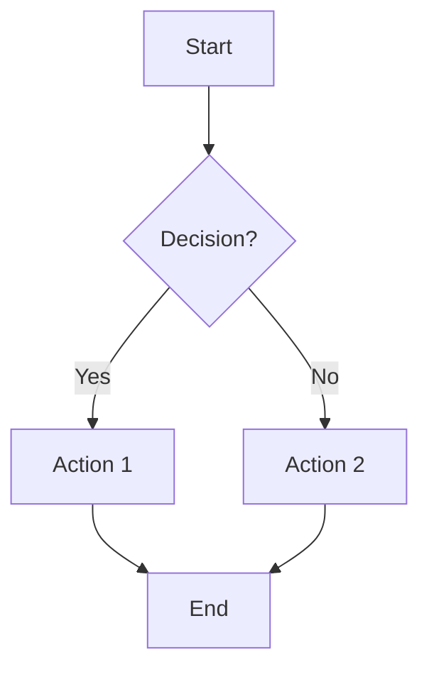

**Direction:** `TD` (top-down), `LR` (left-right), `BT`, `RL`

**Node shapes:**
- `[text]` Rectangle
- `(text)` Rounded
- `{text}` Diamond (decision)
- `((text))` Circle
- `[(text)]` Cylinder (database)
- `([text])` Stadium
- `[[text]]` Subroutine
- `>text]` Flag
- `A@{ icon: "ph:icon-name", label: "Text" }` Icon (Phosphor)

**Arrows:**
- `-->` Arrow
- `---` Line
- `-.->` Dotted arrow
- `==>` Thick arrow
- `--text-->` With label
- `--o` Circle end
- `--x` Cross end

**Subgraphs:**
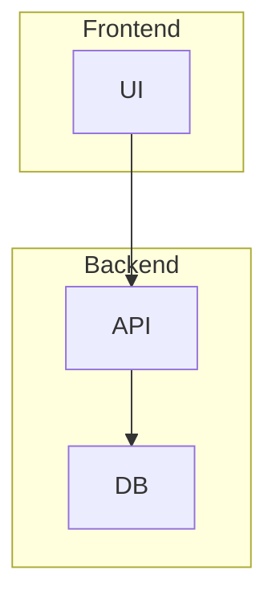

---

### 2. Sequence Diagram

**Best for:** API calls, service interactions, protocols, user flows

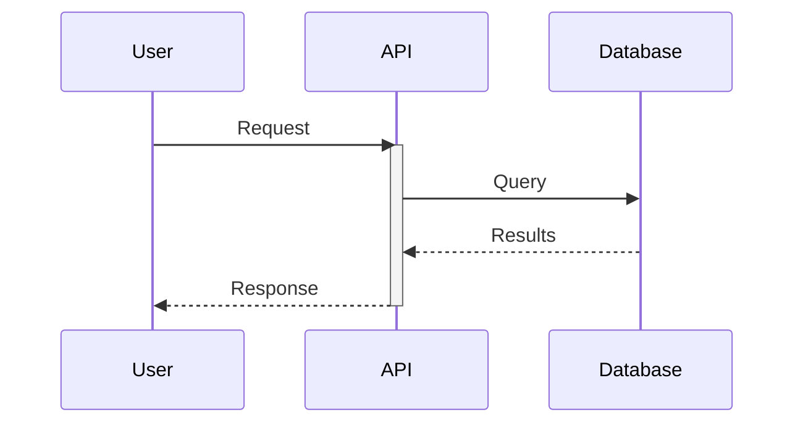

**Message types:**
- `->` Solid line
- `-->` Dotted line
- `->>` Solid with arrow
- `-->>` Dotted with arrow
- `-x` With X
- `-)` Async (open arrow)

**Activation:** `activate`/`deactivate` or `+`/`-` suffix

**Loops & conditions:**
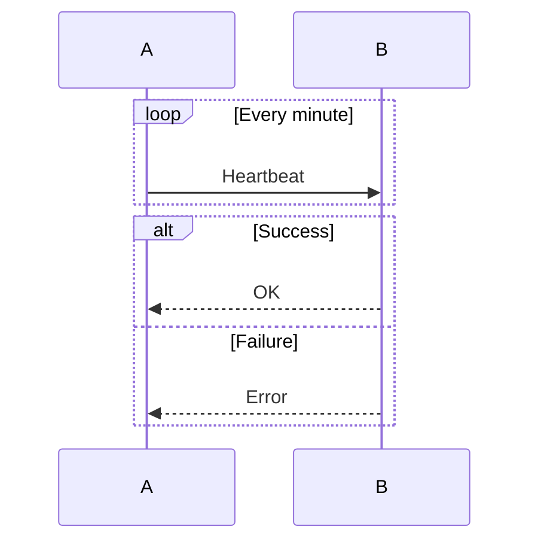

**Notes:** `Note right of A: Text` or `Note over A,B: Spanning`

---

### 3. Class Diagram

**Best for:** Object models, domain models, software architecture

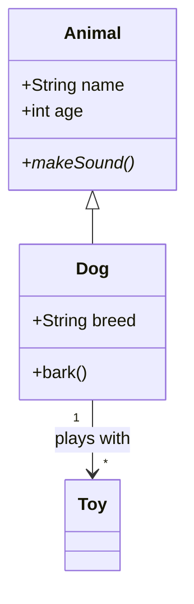

**Visibility:** `+` public, `-` private, `#` protected, `~` package

**Relationships:**
- `<|--` Inheritance
- `*--` Composition
- `o--` Aggregation
- `-->` Association
- `..|>` Realization

**Annotations:** `<<interface>>`, `<<abstract>>`, `<<service>>`, `<<enumeration>>`

---

### 4. State Diagram

**Best for:** State machines, workflows, lifecycles, UI states

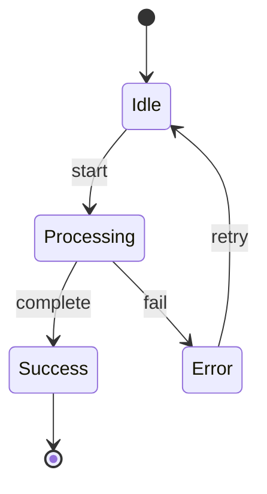

**Composite states:**
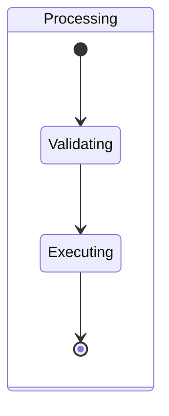

**Forks/joins:**
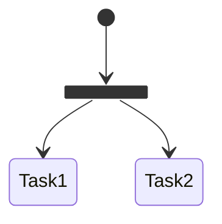

---

### 5. Entity Relationship (ER) Diagram

**Best for:** Database schemas, data models, system relationships

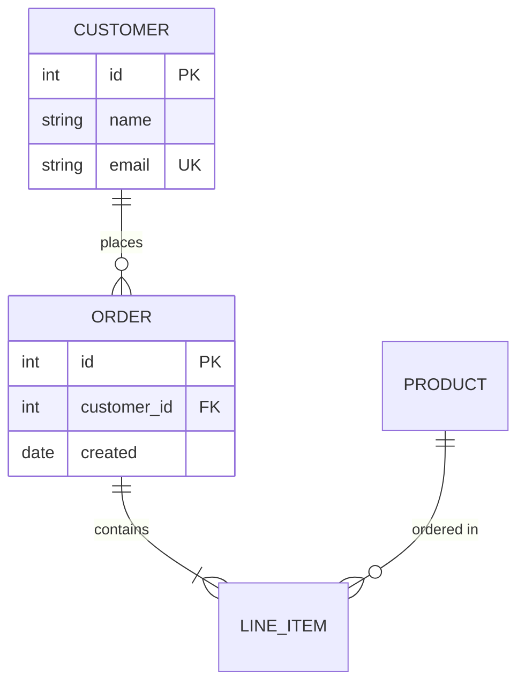

**Cardinality (Crow's Foot):**
- `||` Exactly one
- `|o` Zero or one
- `}|` One or more
- `}o` Zero or more

**Line types:**
- `--` Identifying (solid)
- `..` Non-identifying (dashed)

---

### 6. Gantt Chart

**Best for:** Project timelines, schedules, dependencies, milestones

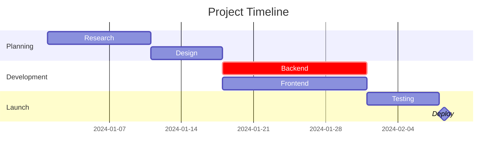

**Task tags:** `done`, `active`, `crit`, `milestone`

**Dependencies:** `after taskId`

**Exclusions:** `excludes weekends`

---

### 7. Mindmap

**Best for:** Brainstorming, concept maps, hierarchical ideas, outlines

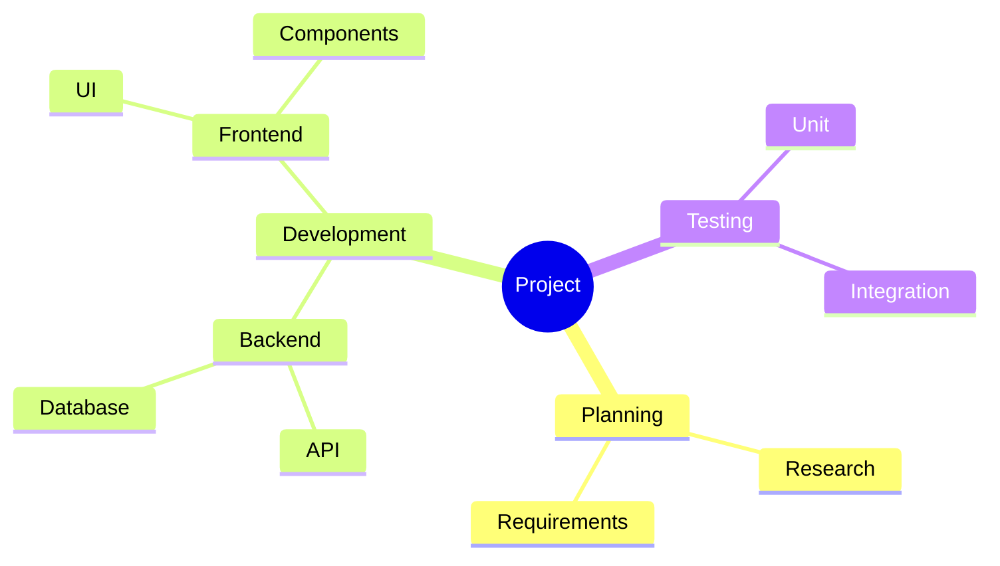

**Node shapes:** `[square]`, `(rounded)`, `((circle))`, `))cloud((`

---

### 8. Timeline

**Best for:** Historical events, project phases, roadmaps

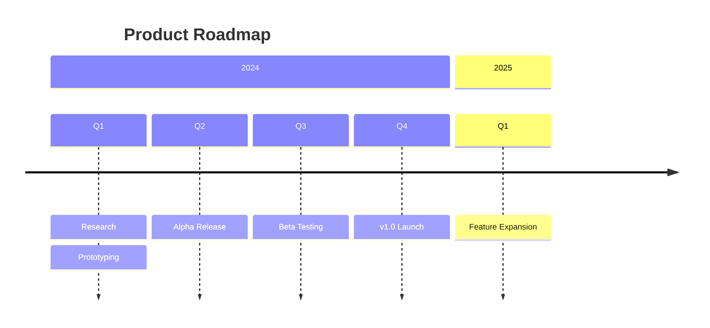

---

### 9. Git Graph

**Best for:** Branch strategies, release flows, merge histories

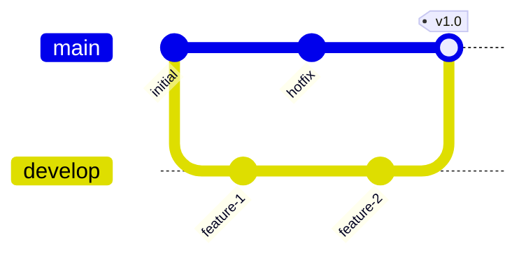

**Commands:** `commit`, `branch`, `checkout`, `merge`, `cherry-pick`

**Commit types:** `type: NORMAL`, `type: REVERSE`, `type: HIGHLIGHT`

---

### 10. Pie Chart

**Best for:** Proportions, distributions, simple breakdowns

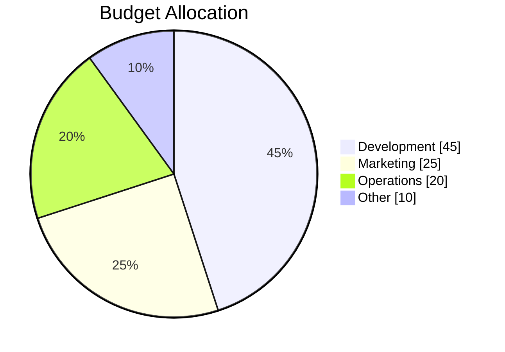

---

### 11. Architecture Diagram

**Best for:** Cloud architecture, system components, infrastructure

```mermaid
architecture-beta
    group api(cloud)[API Layer]
    group data(database)[Data Layer]

    service gateway(internet)[Gateway] in api
    service auth(ph:shield-check)[Auth] in api
    service db(database)[Database] in data

    gateway:R --> L:auth
    auth:B --> T:db
```

**Built-in icons:** `cloud`, `database`, `disk`, `internet`, `server`

**Phosphor icons:** Use any Phosphor icon with the `ph:` prefix — e.g., `(ph:house)`, `(ph:gear)`, `(ph:shield-check)`. Browse all at [phosphoricons.com](https://phosphoricons.com/).

---

### 12. Quadrant Chart

**Best for:** Priority matrices, competitive analysis, 2x2 frameworks

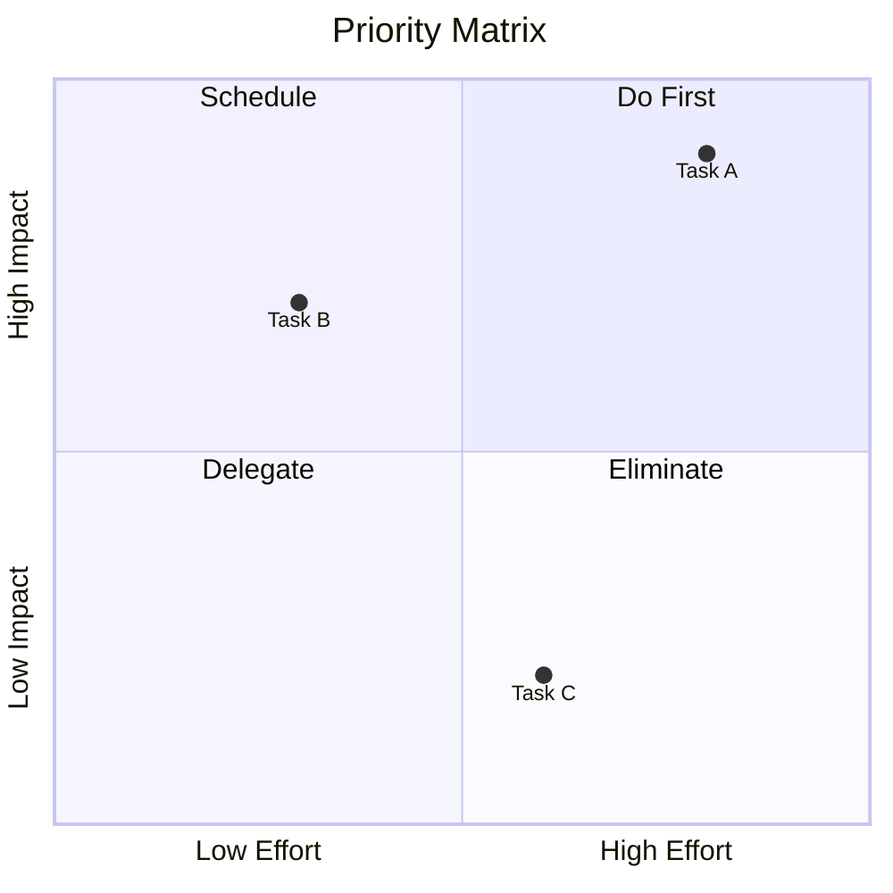

---

### 13. XY Chart

**Best for:** Line charts, bar charts, data visualization

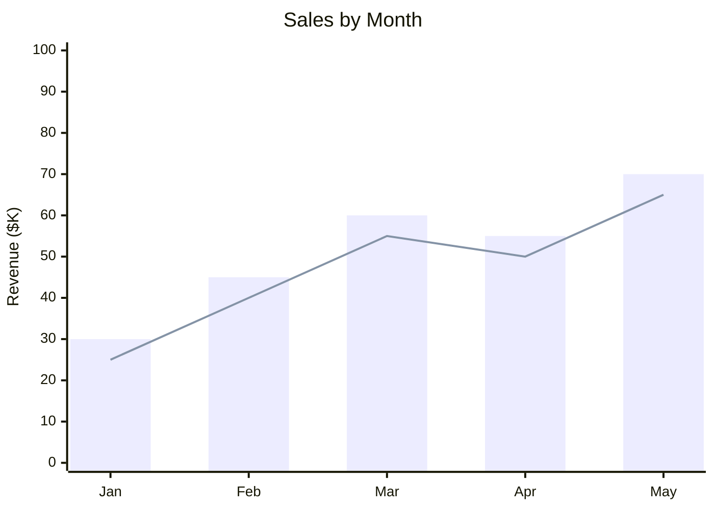

---

### 14. Sankey Diagram

**Best for:** Flow quantities, resource allocation, energy/money flows

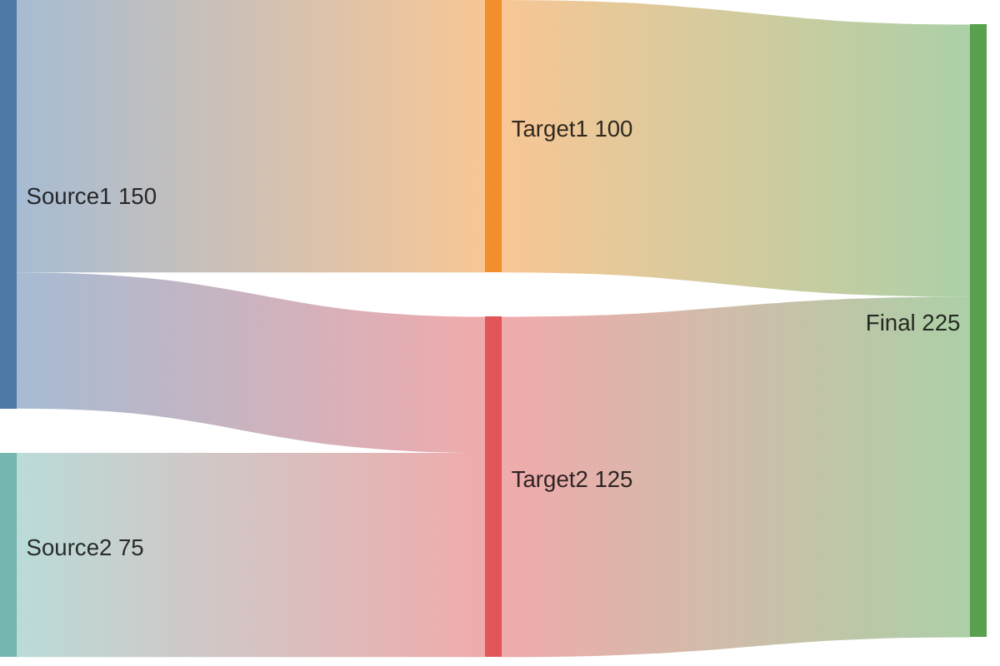

---

### 15. Block Diagram

**Best for:** Simple system blocks, component relationships

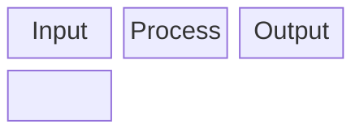

---

### 16. Icon Nodes (Phosphor)

**Best for:** Visual system diagrams, dashboards, feature overviews, navigation maps

Phosphor icons are registered as a Mermaid icon pack. Use the `ph:` prefix with any icon from [phosphoricons.com](https://phosphoricons.com/).

**Flowchart icon nodes:**
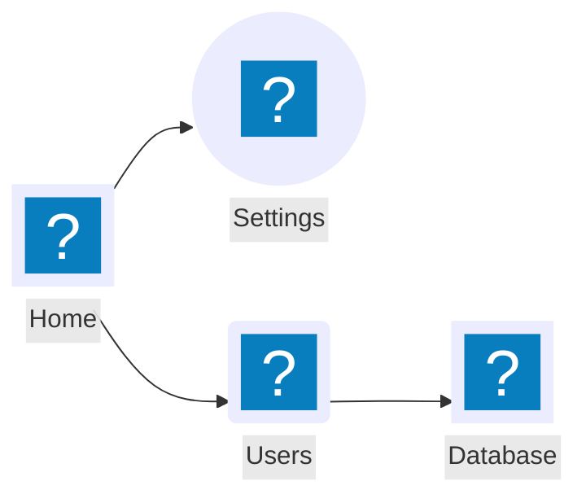

**Icon shape parameters:**

| Parameter | Values | Default | Description |
|-----------|--------|---------|-------------|
| `icon` | `"ph:icon-name"` | required | Phosphor icon (kebab-case) |
| `label` | any string | none | Text label |
| `form` | `square`, `circle`, `rounded` | `square` | Background shape |
| `pos` | `t`, `b` | `b` | Label position |
| `h` | number (min 48) | 48 | Icon height in px |

**Common Phosphor icons for diagrams:**

| Icon | Name | Use for |
|------|------|---------|
| `ph:house` | House | Home, landing page |
| `ph:gear` | Gear | Settings, config |
| `ph:users` | Users | User management |
| `ph:database` | Database | Data storage |
| `ph:shield-check` | Shield Check | Auth, security |
| `ph:cloud` | Cloud | Cloud services |
| `ph:lightning` | Lightning | Events, triggers |
| `ph:chart-bar` | Chart Bar | Analytics, metrics |
| `ph:envelope` | Envelope | Email, notifications |
| `ph:globe` | Globe | Web, public |
| `ph:lock` | Lock | Security, private |
| `ph:robot` | Robot | AI, automation |
| `ph:code` | Code | Development |
| `ph:file-text` | File Text | Documents, content |
| `ph:credit-card` | Credit Card | Payments, billing |

**Architecture diagram with Phosphor icons:**
```mermaid
architecture-beta
    group frontend(ph:browser)[Frontend]
    group backend(ph:cloud)[Backend]

    service app(ph:layout)[App] in frontend
    service api(ph:plugs-connected)[API] in backend
    service auth(ph:shield-check)[Auth] in backend
    service db(ph:database)[Database] in backend

    app:R --> L:api
    api:R --> L:auth
    api:B --> T:db
```

---

## Best Practices

### Choosing the Right Diagram

| Use Case | Diagram Type |
|----------|--------------|
| Process/workflow | Flowchart |
| API/service calls | Sequence |
| Object models | Class |
| State machines | State |
| Database schema | ER |
| Project schedule | Gantt |
| Ideas/brainstorm | Mindmap |
| History/roadmap | Timeline |
| Git branching | GitGraph |
| Proportions | Pie |
| Infrastructure | Architecture |
| Priorities | Quadrant |
| Data trends | XY Chart |
| Resource flows | Sankey |
| Visual system maps | Icon Nodes (Phosphor) |

### General Tips

1. **Start simple** - Add complexity incrementally
2. **Use meaningful IDs** - `userService` not `A`
3. **Add labels** - Arrows without labels are often unclear
4. **Group related items** - Use subgraphs/sections
5. **Consider direction** - `LR` for timelines, `TD` for hierarchies
6. **Keep it readable** - Max 15-20 nodes per diagram
7. **Use Phosphor icons** - `@{ icon: "ph:name" }` makes diagrams more scannable

### Width Recommendations

| Diagram Type | Recommended Width |
|--------------|-------------------|
| Simple flowchart | `1/2` |
| Complex flowchart | `1/1` |
| Sequence diagram | `1/1` |
| ER diagram | `1/1` |
| Gantt chart | `1/1` |
| Mindmap | `1/1` |
| Pie chart | `1/2` or `1/3` |
| Timeline | `1/1` |

---

## Workflow

1. **Ask** what the user wants to visualize
2. **Choose** the appropriate diagram type
3. **Start simple** with core elements
4. **Iterate** to add detail
5. **Set width** based on complexity
6. **Test render** - Mermaid errors are common with syntax

## Common Errors

- Missing spaces around arrows: `A-->B` should be `A --> B`
- Unquoted special characters in labels
- Mismatched brackets/braces
- Wrong diagram type keyword (e.g., `graph` vs `flowchart`)
- Forgetting direction after `flowchart` or `graph`

## Remember

- **Always use `type: diagram`** in content items
- **Prefer `width: 1/1`** for complex diagrams
- **Test syntax** - Mermaid is sensitive to formatting
- **Use labels** - Make relationships clear
- **Keep it simple** - Complex diagrams are hard to read
- **Use `ph:` prefix** for Phosphor icons in flowchart and architecture diagrams
