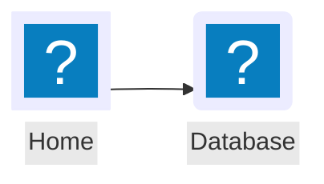

# Chapterwise Diagram Content Type

Create visual diagrams using [Mermaid.js](https://mermaid.js.org/) within Codex files. Mermaid supports 23 diagram types rendered client-side with dark mode support.

## Codex Output Formats

### 1. Inline Diagram (in Codex content)

```yaml
content:
  - key: system-flow
    name: "System Architecture"
    type: diagram
    width: 1/1
    value: |
      flowchart TD
        A[Client] --> B[API Gateway]
        B --> C[Auth Service]
        B --> D[Data Service]
```

### 2. External .mermaid File

```yaml
content:
  - key: er-model
    type: diagram
    width: 1/1
    include: /diagrams/schema.mermaid
```

### 3. Body Shortcode (in prose)

````markdown
body: |
  Here's the architecture:

  ```mermaid
  flowchart LR
    A --> B --> C
  ```
````

---

## Supported Diagram Types

| Diagram Type | Keyword | Best For |
|---|---|---|
| Flowchart | `flowchart TD` | Process flows, decision trees, algorithms |
| Sequence | `sequenceDiagram` | API calls, service interactions |
| Class | `classDiagram` | Object models, domain models |
| State | `stateDiagram-v2` | State machines, workflows, lifecycles |
| ER | `erDiagram` | Database schemas, data models |
| Gantt | `gantt` | Project timelines, schedules |
| Mindmap | `mindmap` | Brainstorming, concept maps |
| Timeline | `timeline` | Historical events, roadmaps |
| Git Graph | `gitGraph` | Branch strategies, release flows |
| Pie Chart | `pie` | Proportions, distributions |
| Architecture | `architecture-beta` | Cloud architecture, infrastructure |
| Quadrant | `quadrantChart` | Priority matrices, 2x2 frameworks |
| XY Chart | `xychart-beta` | Line/bar charts, data trends |
| Sankey | `sankey-beta` | Flow quantities, resource allocation |
| Block | `block-beta` | Simple system blocks |

> Claude already knows Mermaid syntax. Focus on wrapping the output in the Codex format shown above, not on learning Mermaid.

---

## Phosphor Icon Nodes

Phosphor icons are registered as a Mermaid icon pack. Use the `ph:` prefix with any icon from [phosphoricons.com](https://phosphoricons.com/).

**Flowchart icon nodes:**


**Icon shape parameters:** `icon` (required, `"ph:icon-name"`), `label`, `form` (`square`|`circle`|`rounded`), `pos` (`t`|`b`), `h` (min 48)

**Architecture diagram with Phosphor icons:**

```mermaid
architecture-beta
    group backend(ph:cloud)[Backend]
    service api(ph:plugs-connected)[API] in backend
    service db(ph:database)[Database] in backend
    api:B --> T:db
```


**Common icons:** `ph:house`, `ph:gear`, `ph:users`, `ph:database`, `ph:shield-check`, `ph:cloud`, `ph:lightning`, `ph:chart-bar`, `ph:envelope`, `ph:globe`, `ph:lock`, `ph:robot`, `ph:code`, `ph:file-text`, `ph:credit-card`

---

## Width Recommendations

| Diagram Type | Width |
|---|---|
| Simple flowchart, pie chart | `1/2` or `1/3` |
| Complex flowchart, sequence, ER, gantt, mindmap, timeline | `1/1` |

## Workflow

1. **Ask** what the user wants to visualize
2. **Choose** the appropriate diagram type
3. **Start simple** with core elements, iterate to add detail
4. **Set width** based on complexity
5. **Always use `type: diagram`** in content items
6. **Use `ph:` prefix** for Phosphor icons in flowchart and architecture diagrams

## Common Errors

- Missing spaces around arrows: `A-->B` should be `A --> B`
- Unquoted special characters in labels
- Wrong keyword (e.g., `graph` vs `flowchart`)
- Forgetting direction after `flowchart`
